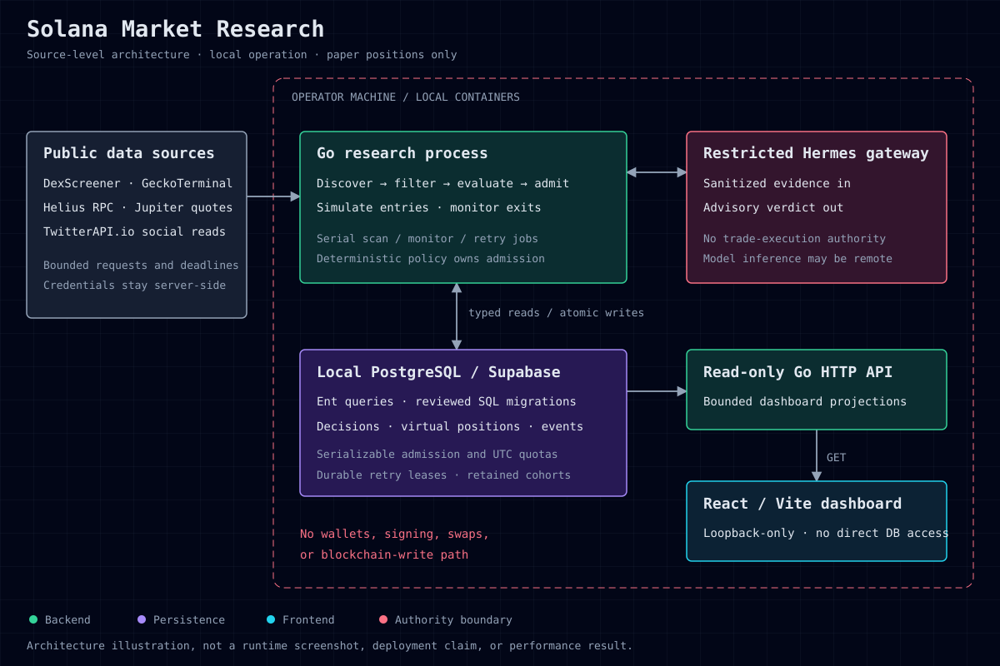

# Solana Market Research

A local Go system for collecting Solana token-pool evidence and evaluating a paper-trading policy. It combines bounded market and social reads, deterministic rules, an advisory model, and transactional PostgreSQL persistence. A read-only React dashboard shows the resulting decisions and virtual positions.

**Status:** independent research software, public source, local-only runtime. All trades are simulated database records. There is no hosted service, wallet integration, transaction signing, or blockchain execution. Paper results do not establish a profitable strategy.



[Engineering decisions](docs/engineering.md) · [Local setup](docs/local-setup.md) · [Tests and CI](https://github.com/SourceSenseiTheRealOne/solana-market-research/actions) · [MIT license](LICENSE)

## What is implemented

- Market discovery and eligibility checks run before paid social and model requests. Provider requests have explicit limits and deadlines.
- Serializable database transactions reserve daily quota, reject duplicate admissions, and persist a decision and pending paper position together.
- Virtual entries and exits use read-only quote evidence. Monitoring applies take-profit, stop-loss, and holding-time rules.
- Durable retry leases retain a small number of candidates with temporarily incomplete market evidence. Retries still pass through the full policy.
- A GET-only HTTP API exposes dashboard projections rather than provider credentials or raw social evidence.

The active `bold-momentum-v3` configuration defaults to $100 per virtual position, at most three active positions and 30 new admissions per UTC day. These are experiment parameters, not return forecasts. See the [policy and trade-offs](docs/engineering.md#policy-and-trade-offs).

## Stack and source map

| Part | Technology | Source |
| --- | --- | --- |
| Research service and policy | Go; domain/application interfaces | [`cmd/paper-bot`](cmd/paper-bot), [`internal`](internal) |
| Persistence | PostgreSQL through local Supabase; Ent; Atlas SQL migrations | [`ent`](ent), [`supabase/migrations`](supabase/migrations) |
| Dashboard | React, TypeScript, Vite, TanStack Query | [`dashboard`](dashboard) |
| Local packaging | Docker Compose; Go API and nginx-served dashboard | [`compose.yaml`](compose.yaml) |
| Verification | Go tests/race detector, PostgreSQL contracts, Vitest, shell guards | [`tests`](tests), [CI workflow](.github/workflows/ci.yml) |

The Go module is `github.com/SourceSenseiTheRealOne/solana-market-research`. Dependency versions are recorded in `go.mod` and the dashboard lockfile.

## Get started

```sh
git clone https://github.com/SourceSenseiTheRealOne/solana-market-research.git
cd solana-market-research
go mod download
pnpm --dir dashboard install --frozen-lockfile
```

Use Go 1.26.2, Node.js 22 or a compatible newer release, and pnpm 10.30.1. Docker and the Supabase CLI are needed for the local runtime. Follow [local setup](docs/local-setup.md) to start a database and configure the service. Automation defaults to disabled; installing dependencies or running tests does not enable it.

When explicitly started, the dashboard is at `http://127.0.0.1:4173/` and the API health route is `http://127.0.0.1:8080/healthz`. Neither is a public demo URL.

## Verification

```sh
go test ./...
go test -race ./...
go vet ./...
pnpm --dir dashboard run verify
bash scripts/verify-no-live-trading-deps.sh
bash tests/verify-compose-topology.sh
bash tests/verify-github-actions.sh
git diff --check
```

Database-backed tests need `TEST_DATABASE_URL` pointing to a disposable database with the committed migrations applied. Without it, those tests skip; a green unit run alone does not prove persistence. CI creates an ephemeral PostgreSQL service and runs the repository/integration contracts separately. Never use the research database for tests.

On Windows Git-Bash, use `pnpm.cmd` if the `pnpm` shim fails. The Go race detector also requires a supported C toolchain. Do not run `docker compose config` or the existing `make verify` target in a credential-bearing checkout: they can print interpolated environment values. Use the explicit commands above.

## Limits

This is a single-operator research system, not a distributed trading platform or audited financial product. Missing provider evidence can prevent admission or valuation; quote-based simulations cannot reproduce executable fills under all market conditions. The dashboard has no authentication because it is restricted to loopback. Do not expose it publicly without a separate security design.

The repository and display name were renamed from Solana Hype Paper Bot. Existing Compose, Supabase, and local Hermes identities intentionally retain `solana-hype-paper-bot` so stored data and configuration remain associated with the same runtime. See the [rename boundary](docs/local-setup.md#existing-installations).
